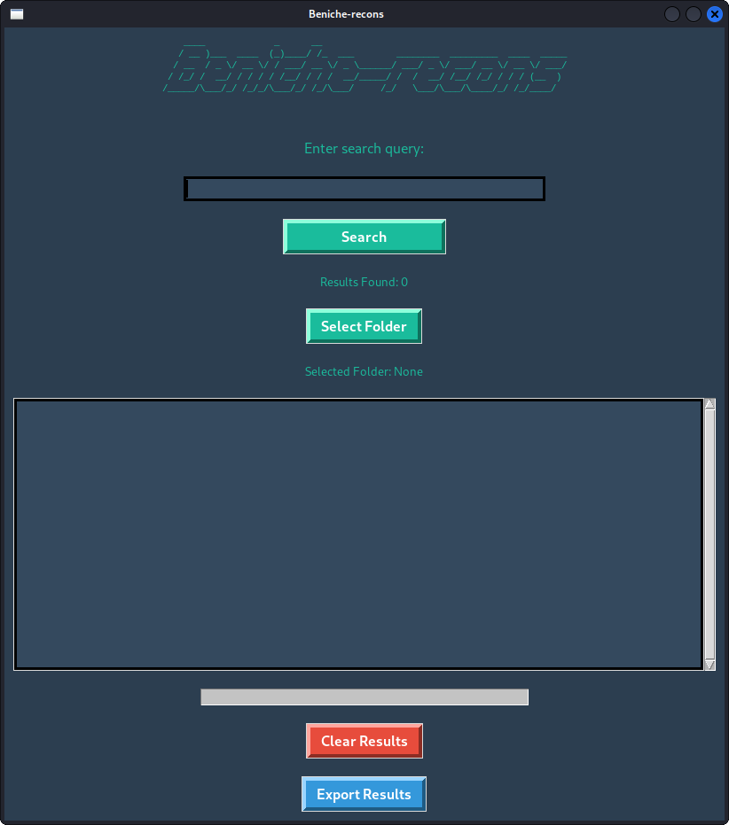

# Beniche-recons

Beniche-recons is a Python-based GUI tool built with Tkinter that allows users to search for specific terms (e.g., emails or passwords) across multiple `.txt` files in a selected folder. It includes features like folder selection, a search bar, a progress bar, and results display.

---

## Features

- **Folder Selection**: Scan all `.txt` files in a selected folder (and optionally subfolders).
- **Search Functionality**: Search for terms across all `.txt` files.
- **Progress Bar**: Visual feedback on the search progress.
- **Export Results**: Save search results to a `.txt` file.
- **Dark Theme**: Sleek and modern user interface.

---

## Screenshot



---

## Requirements

- Python 3.x
- Tkinter (usually comes pre-installed with Python)
- `pyfiglet` library (for ASCII art)

---

## Installation

1. Clone the repository:
   ```bash
   git clone https://github.com/blackscapo/beniche-recon.git

    Navigate to the project folder:

    cd beniche-recon

    Install the required library:
   
    pip install pyfiglet

Usage

    Run the script:
    python beniche_recons.py

    Select a folder containing .txt files.

    Enter a search term (e.g., an email or password).

    View the results in the GUI.

    Optionally, export the results to a .txt file.

Contributing

Contributions are welcome! 

  

Author
blackscapo
License
This project is licensed under the MIT License. See the LICENSE file for details.


